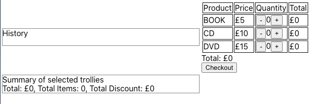
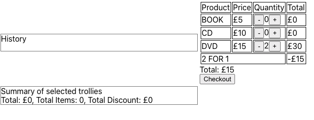
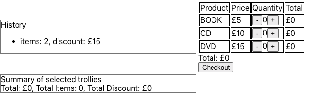
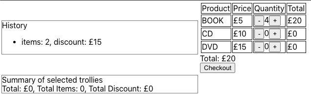
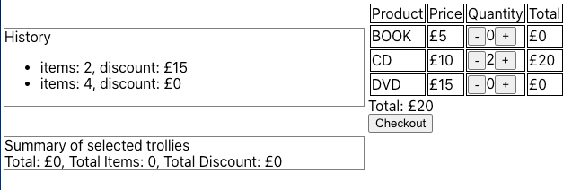
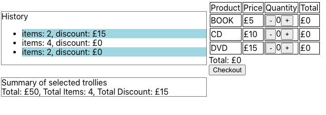

# Generic Retailer

Generic retailer is creating a self service CLI to allow developers to order products.

A developer started implementing but didn't get very far at all, the only thing left are these notes.

Prices:
 - Book £5
 - CD  £10
 - DVD £15
 
Todo's:

 - [ ] Calculate total
 - [ ] Print receipt (show items, price and total)
   - [ ] Aggregate items in receipt
   - [ ] items left aligned, prices right aligned
   - [ ] see CliTest fo receipt format
 - [ ] Add discounts (2 for 1 on DVDs and 20% off on Thursdays)
   - [ ] Only one discount can apply to an item but customer should get best available discount per item. i.e. 3 DVDs on a Thursday would be £27 (2 for 1 and 20% off the 3rd).

## The 1st Task

Given the above please finish implementing the rest of the system. 
Whilst this store has very few items at the moment, we know it's going to grow massively in the next few months.
Please create a solution that is extendable and makes use of common patterns and OO concepts where appropriate.
Please feel free to make use any third-party libraries.

## The 2nd Task
Due to its popularity, they decide to implement a browser user interface to this functionality with some additional capabilities.

Todo's:

 - [ ] Implement a UI for use in a browser to add Books, CDs and DVDs to checkout with discount
 - [ ] Once a trolley is checked out it is saved to the server (Database.java)
 - [ ] The list of previous checkouts is listed with the number of items and discount 
 - [ ] The user is able to choose checked out trollies to see a summary

Please use react and any other third-party libraries to implement this functionality.
Some screenshots are shown below to explain the functionality further and to suggest a design.

